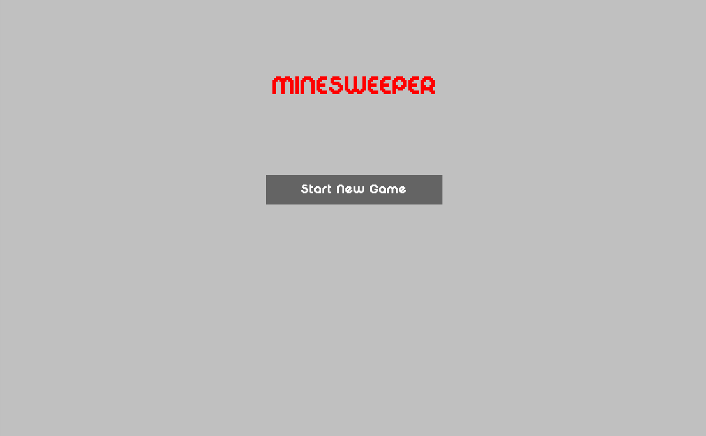

# Minesweeper

A classic Minesweeper game implementation built with Python and Pygame. This project features a complete game experience with difficulty selection, interactive gameplay, and game-over/win screens.



## Features

- **Multiple Difficulty Levels**: Choose from Beginner, Intermediate, and Expert modes
- **Interactive Gameplay**: Click to reveal tiles, right-click to place/remove flags
- **Game Logic**: Automatic tile revelation for connected empty cells
- **Screen Navigation**: Welcome screen, difficulty selection, and game-over screens
- **Visual Feedback**: Real-time display of remaining mines and game state

## Project Structure

```
minesweeper/
├── main.py                 # Entry point for the application
├── requirements.txt        # Python dependencies
├── game/                   # Game logic module
│   └── minesweeper_game.py # Core Minesweeper game logic
├── ui/                     # User interface module
│   ├── minesweeper_ui.py  # Main UI controller
│   └── screens/            # Screen classes
│       ├── base_screen.py           # Base screen class
│       ├── welcome_screen.py        # Welcome/splash screen
│       ├── new_game.py              # New game options screen
│       ├── difficulty.py            # Difficulty selection screen
│       ├── game_screen.py           # Main gameplay screen
│       ├── game_over.py             # Game over screen
│       └── game_won.py              # Victory screen
└── static/                 # Game assets
    ├── tile.png            # Game tile image
    ├── bomb.png            # Mine/bomb image
    ├── flag.png            # Flag image
    └── DigitalDisco.ttf    # Custom font
```

## Requirements

- Python 3.10+
- Pygame 2.5+

## Installation

1. Clone the repository:
```bash
git clone https://github.com/yourusername/minesweeper.git
cd minesweeper
```

2. Create a virtual environment:
```bash
python -m venv env
source env/bin/activate  # On Windows: env\Scripts\activate
```

3. Install dependencies:
```bash
pip install -r requirements.txt
```

## Usage

Run the application:
```bash
python main.py
```

### Game Controls

- **Left Click**: Reveal a tile
- **Right Click**: Place or remove a flag on a tile
- **New Game Button**: Start a fresh game
- **Quit Button**: Exit the game

## Game Rules

- The board contains hidden mines
- Click to reveal tiles and uncover numbers indicating adjacent mines
- Flag tiles you believe contain mines
- Reveal all non-mine tiles to win
- Hitting a mine ends the game

## Difficulty Levels

| Difficulty | Grid | Mines |
|-----------|------|-------|
| Beginner  | 9×9  | 10    |
| Intermediate | 16×16 | 40 |
| Expert    | 16×30 | 99    |

## Architecture

The project follows a modular architecture:

- **Game Logic Layer** (`game/`): Contains the pure game logic separated from UI concerns
- **UI Layer** (`ui/`): Handles all Pygame rendering and user interaction
- **Screen-Based Navigation**: Each game state (welcome, difficulty, gameplay, etc.) is managed by a screen class

## Contributing

Contributions are welcome! Feel free to submit issues and enhancement requests.

## Author

Created as a personal project to practice Python game development with Pygame.
